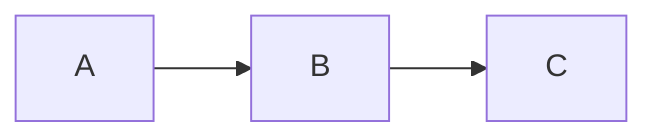
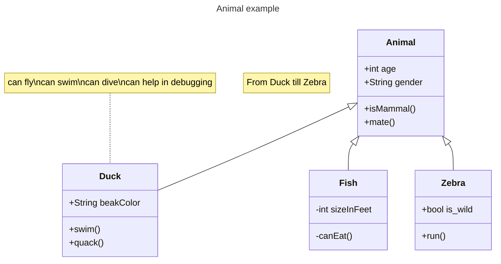

Pythonのハイライト確認
```python
items = ["item1", "item2"]
for item in items:
	print(item)
```

JavaScriptのハイライト確認 
```js
const test = "test";
```

Mermaidの確認


Officialから取ってきたクラス図の確認


Draw.io


table

| 項目1 | 項目2 | 項目3 | 項目4 | 1   | 2   | 3   | 4   | 5   | 6   | 7   | 8   | 9   |
| --- | --- | --- | --- | --- | --- | --- | --- | --- | --- | --- | --- | --- |
| 1   | 2   | 3   | 4   | 12  | 3   |     |     | 6   |     |     |     |     |
| a   | b   | c   | d   |     |     |     |     |     |     |     |     |     |
